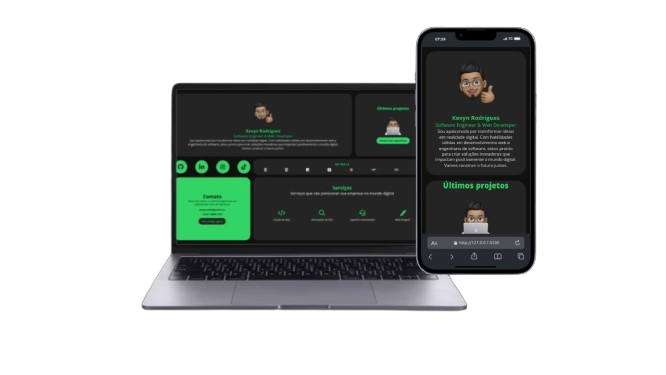

# KevynCode Portfolio 💻☕

Bem-vindo ao repositório do meu portfólio! Este projeto é uma vitrine dos meus trabalhos e habilidades como desenvolvedor.

## Descrição

Este portfólio inclui uma coleção de meus projetos mais notáveis, detalhando meu processo de desenvolvimento, as tecnologias que utilizo e as habilidades que adquiri ao longo do tempo.

## Tecnologias Utilizadas

- HTML5
- CSS3
- JavaScript

## Demonstração do Projeto

  

### Link do projeto [KevynCode | Portfolio](https://kevyncode.github.io/portfolio)

Projeto em desenvolvimento...

## Licença

Este projeto está licenciado sob a MIT License (MIT).

## Contato

[LinkedIn](https://www.linkedin.com/in/kevyncode)  
[GitHub](https://github.com/kevyncode) 
[WhatsApp](https://wa.me/5587998092391)
